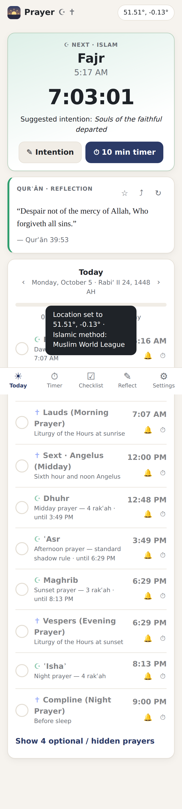
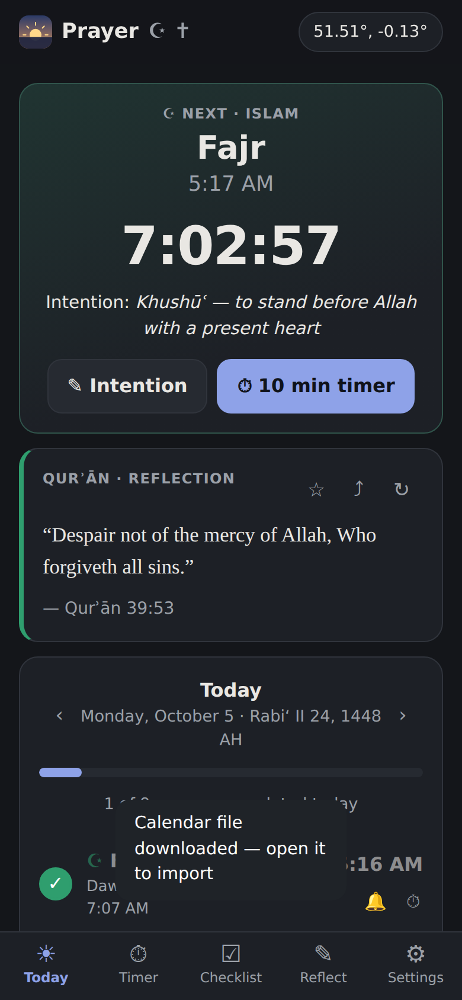
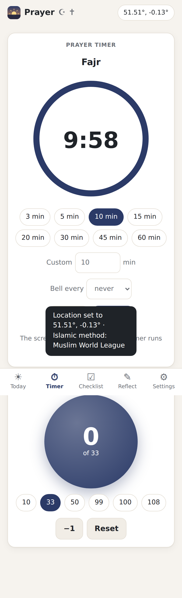
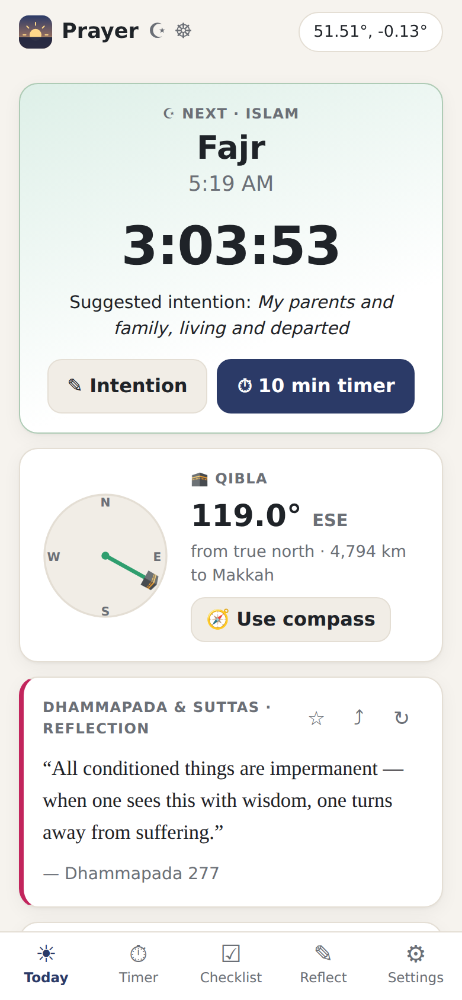
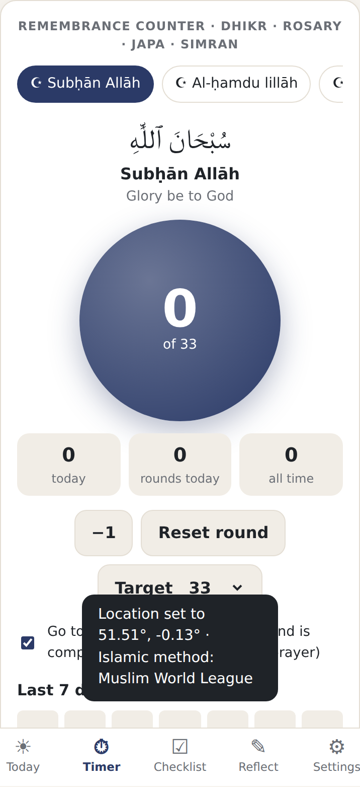

# Prayer — prayer times for every faith

A **free, private, installable web app** for daily prayer in any tradition. It has no ads, no accounts, and no tracking, and it works offline after the first visit.

<p align="center">
  
  
  
  
  
</p>

## Features

| | |
|---|---|
| 📍 **Location-aware times** | Uses GPS, a city search, or coordinates you enter. Times are calculated **on the device** from the sun's position, so they change with the seasons and with where you are. The calculation method is picked for your region automatically (for example, ISNA in North America, Umm al-Qura in Saudi Arabia, Ḥanafī ʿAsr in South Asia, and 40-minute candle lighting in Jerusalem). |
| 🕊 **9 traditions** | Islam, Christianity, Judaism, Hinduism, Sikhism, Buddhism, Baháʼí Faith, Zoroastrianism, and Spiritual / Interfaith. You can combine several (useful for interfaith households) and add your own **custom prayers**, at a fixed time or relative to sunrise, noon, or sunset. |
| 🔔 **Custom notifications** | Each prayer has its own on/off switch. There's an early reminder (0–60 min before) and an at-time alert, an optional scripture quote and intention in the notification, a daily quote reminder, and a soft bell. **Export to calendar (.ics)** gives you alarms that work even when the app is closed. |
| ⏱ **Prayer timer** | A countdown with presets, interval bells, and a screen-awake lock. You can start it from any prayer, and each prayer can have its own default length. |
| ☑ **Checklists** | Daily, weekly, and monthly lists that reset on their own. They start with suggestions for your traditions, and a history chart shows past completion. You can also tick off each prayer on the Today screen. |
| ✎ **Intentions & scripture** | Suggested intentions for each prayer (or write your own), a quote of the day from your tradition's books (Qurʾān, Bible, Tanakh, Gita, Guru Granth Sahib, Dhammapada, Baháʼí Writings, Avesta…), favourites, and sharing. |
| 🕌 **Adhan** | For the five Islamic prayers, you can play the full adhan, only the first part (with a fade-out), or nothing. This can be set separately for each prayer, for example silent at Fajr. There's a **muezzin menu** of built-in recordings (see [`audio/README.md`](audio/README.md)), or users can pick their own audio file. A separate Fajr adhan, volume control, previews, and a stop button (also on the lock screen) are included. |
| 🕋 **Qibla** | The direction and distance to the Kaʿbah from your location, with a live compass on phones. |
| 📿 **Remembrance counter** | Phrases for each tradition: tasbīḥ (Subḥān Allāh 33 · Al-ḥamdu lillāh 33 · Allāhu akbar 34…), the Jesus Prayer and rosary, the hundred daily blessings and Psalms, Gāyatrī and Hare Kṛṣṇa japa (108), Vāhigurū simran, Oṃ Maṇi Padme Hūṃ and Namo Amituofo, Alláh-u-Abhá ×95, Yathā Ahū Vairyō, and more. You can add your own phrases. Each phrase has its own target and its own count for the round, the day, and all time, plus a 7-day history. It can also move on to the next phrase automatically when a round ends. |
| 🗓 **Calendars** | The Hijri date (Umm al-Qura) and Hebrew date are shown when relevant. Shabbat candle lighting and Havdalah, Jumuʿah, Sunday worship, and approximate Uposatha days are shown on the right days. |
| 💾 **Your data** | Everything stays in the browser (localStorage). You can back up, restore, or reset it. |

### Where the prayer times come from

All times are **calculated on your device** from the sun's position at your location. Nothing is downloaded. The math is the same as the open-source [PrayTimes.org](https://praytimes.org/) library, and so are its calculation methods and angles: MWL, ISNA, Egypt, Umm al-Qura (Makkah; ʿIshaʾ is 90 minutes after Maghrib, or 120 minutes in Ramadan), Karachi, Tehran, and Jafari. Gulf, Kuwait, Qatar, Singapore, France, Turkey, and Russia are also included. The method is picked for your region automatically. You can change it in Settings, and you can shift any single time by a few minutes to match your mosque's timetable.

### Prayer schedules

- **Islam**: Fajr, Sunrise, Dhuhr / Jumuʿah, ʿAsr, Maghrib, ʿIshaʾ, and Tahajjud (optional). There are 14 calculation methods, the Standard or Ḥanafī ʿAsr rule, and high-latitude rules.
- **Christianity**: Liturgy of the Hours: Lauds, Terce, Sext / Angelus, None (Hour of Mercy), Vespers, Compline, and Sunday worship.
- **Judaism**: Shacharit (to Sof Zman Tefillah), Sof Zman Kriat Shema, Mincha (from Mincha Gedolah), Maariv (at Tzeit 8.5°), candle lighting, and Havdalah.
- **Hinduism**: Brahma Muhurta, and the Prātaḥ, Mādhyāhnika, and Sāyaṁ Sandhyā.
- **Sikhism**: Amrit Vela Nitnem (last quarter of the night), Ardas, Rehras Sahib, and Kirtan Sohila.
- **Buddhism**: Morning chanting, midday mindfulness, evening chanting, dedication of merit, and Uposatha.
- **Baháʼí**: Obligatory prayer windows (sunrise to noon, noon to sunset, and sunset to 2 hours after).
- **Zoroastrianism**: The five Gāhs (Hāvan, Rapithwin, Uzerin, Aiwisruthrem, Ushahin).
- **Spiritual**: Morning intention, midday pause, evening gratitude, and night reflection.

Every time can be shifted by ± minutes to match your local mosque, church, synagogue, or gurdwara, and any prayer can be hidden.

## Run it locally

You don't need to build or install anything. The app is plain HTML, CSS, and JavaScript modules.

```bash
npm start          # or: python3 -m http.server 8080
# open http://localhost:8080
npm test           # calculation tests (Node 18+)
```

## Publish it for free

**GitHub Pages:** go to repo **Settings → Pages → Deploy from a branch**, then choose `main` and `/ (root)`. The app will be live at `https://<user>.github.io/<repo>/`. On a phone, open that link and choose **Add to Home Screen** to install it like an app. Netlify, Cloudflare Pages, and Vercel also work: just upload the folder.

### Note on notifications

Web apps can show notifications only while the app is open or was recently in the background. Browsers don't let a site schedule alarms for later while it's closed. For alarms you can rely on, use **Settings → Notifications → Export 30 days to calendar**. Every prayer is added to your phone's calendar with its own alarm.

To publish in the Play Store or App Store later, wrap this folder with [Capacitor](https://capacitorjs.com/) and use its Local Notifications plugin. The calculation and UI code can be reused unchanged.

## Updates never erase user data

Settings and history are stored under one fixed key on the device. Each saved copy carries a version number. When a new version of the app changes the data's shape, it upgrades the saved data in place by adding fields, never removing them. Before upgrading, it keeps an untouched copy of the old data (`prayer-app-v1.backup-v<n>`). Tests check every upgrade path (`npm test`).

## Privacy

- Prayer times are calculated on your device. Your coordinates are not sent anywhere for that.
- City search sends only the text you type to the free [Open-Meteo geocoding API](https://open-meteo.com/).
- After using GPS, the app looks up your town's name at BigDataCloud's free reverse-geocoding service. This is optional: if it fails, the app shows your coordinates instead.

## Project layout

```
index.html, css/styles.css, sw.js, manifest.webmanifest
js/astro.js        sun position math (PrayTimes / NOAA approximations, ~1 min accuracy)
js/traditions.js   schedules for every tradition, Islamic methods, regional defaults
js/content.js      quotes, intention suggestions, starter checklists
js/tz.js           time-zone helpers (Intl only)
js/notify.js       reminder scheduler, notifications, bell sound
js/ics.js          calendar export
js/adhan.js        adhan playback, muezzin catalog (audio/catalog.json)
js/media.js        user audio files (IndexedDB)
js/qibla.js        qibla bearing, distance and live compass
js/views/*.js      Today, Timer, Checklist, Reflect, Settings screens
tests/             node:test suite
```

The scripture passages come from public-domain translations (KJV, JPS 1917, Pickthall, Müller) or are plain-English renderings of well-known verses. Calculated times are approximations, so please confirm important times (for example, fasting) with your local religious authority.
